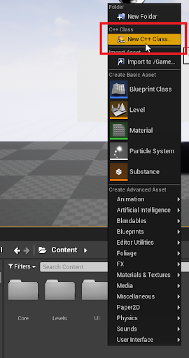
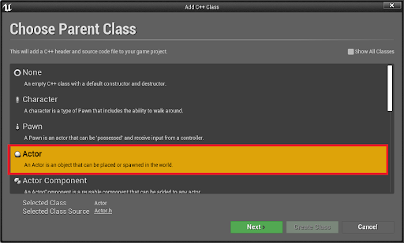
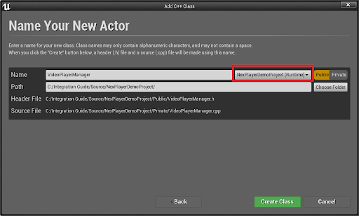
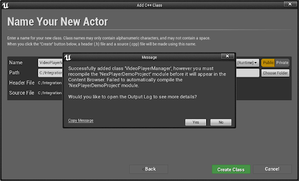
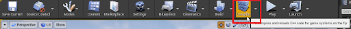
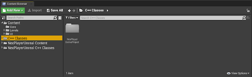
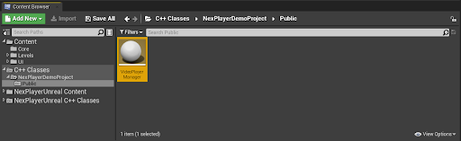
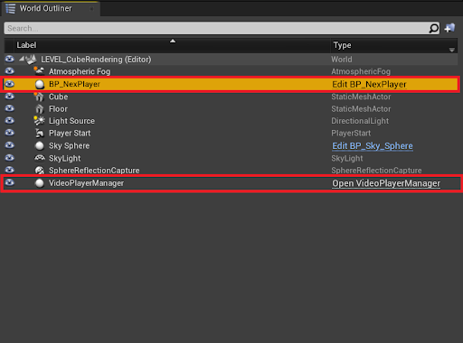

# Code Integration 

The NexPlayer™ Plugin for Unreal Engine API allows the use of video player functionalities through C++ code.

In the following sections are described all the procedures to implement all the different functionalities of the video player through C++ programming in Unreal Engine.

## Video Player - Configuration

The NexPlayer™ video player for Unreal Engine must have the following basic procedures to manage the video player through C++ code:

- Add the plugin to Build.cs file
- Create the  C++ Actor

### Add the plugin to the Build.cs file

To manage the NexPlayer™ video player using the C++ API it is required to add the plugin to the public dependencies of your project, following the standard process to add a C++ Unreal Engine plugin.

This procedure consists in adding the keyword “NexPlayerUnreal” to the PublicDependencyModuleNames list in the [ProjectName].Build.cs file:

```csharp
using UnrealBuildTool;

public class NexPlayerDemoProject : ModuleRules
{
	public NexPlayerDemoProject(ReadOnlyTargetRules Target) : base(Target)
	{
		PCHUsage = PCHUsageMode.UseExplicitOrSharedPCHs;
	
		PublicDependencyModuleNames.AddRange(new string[] { "Core", "CoreUObject", "Engine", "InputCore", "NexPlayerUnreal" });

		PrivateDependencyModuleNames.AddRange(new string[] {  });

		// Uncomment if you are using Slate UI
		// PrivateDependencyModuleNames.AddRange(new string[] { "Slate", "SlateCore" });

		// Uncomment if you are using online features
		// PrivateDependencyModuleNames.Add("OnlineSubsystem");

		// To include OnlineSubsystemSteam, add it to the plugins section in your uproject file with the Enabled attribute set to true
	}
}
```

This file can be found at the following path: /Source/[ProjectName]/[ProjectName].Build.cs

### Create the C++ Actor

To create a sample actor that will include the C++ code, execute the following steps:

- Right click on the Content Browser and select “New C++ Class…”:



- Select Actor as the Parent Class:



- Select a name for the new actor like “VideoPlayerManager” and save the file in your Unreal Engine project:



- Unreal will send a notification about the creation of the C++ class. If the class is created correctly it will send the following message:



- Select the Compile button in the Unreal ToolBar.



- The new C++ Actor must appear under the “C++ Classes” section in the Content Browser. If it doesn’t, close the project, delete the binaries folder and reopen the project.



- Open the C++ Actor to start writing the code:



- To use the new Video Player Manager, place the BP_NexPlayer Actor and the new Actor in the scene:



## Play/Resume Video Playback

The NexPlayer™ Plugin for Unreal Engine API provides a system to Play the video content if player status is Stop or Pause.

- To Resume the video playback the following function must be used:

```csharp
UNexPlayerUnrealFunctions::Resume();
```

- This function can be called from any other function:

```csharp
#include "VideoPlayerManager.h"

#include "NexPlayerUnrealFunctions.h"

AVideoPlayerManager::AVideoPlayerManager()
{
	PrimaryActorTick.bCanEverTick = true;
}

void AVideoPlayerManager::Tick(float DeltaTime)
{
	APlayerController* controller = GetWorld()->GetFirstPlayerController();
	if(controller->WasInputKeyJustReleased(FKey("R")))
	{
		UNexPlayerUnrealFunctions::Resume();
	}
}
```

## Pause Video Playback

The NexPlayer™ Plugin for Unreal Engine API provides a system to Pause the video content if player status is Play.

- To Pause the video playback the following function must be used:

```csharp
UNexPlayerUnrealFunctions::Pause();
```

- This function can be called from any other function:

```csharp
#include "VideoPlayerManager.h"

#include "NexPlayerUnrealFunctions.h"

AVideoPlayerManager::AVideoPlayerManager()
{
	PrimaryActorTick.bCanEverTick = true;
}

void AVideoPlayerManager::Tick(float DeltaTime)
{
	APlayerController* controller = GetWorld()->GetFirstPlayerController();
	if(controller->WasInputKeyJustReleased(FKey("P")))
	{
		UNexPlayerUnrealFunctions::Pause();
	}
}
```

## Stop Video Playback

The NexPlayer™ Plugin for Unreal Engine API provides a system to Stop the video content if player status is Play. The playback current time will be set to 0 automatically.

- To Stop the video playback the following function must be used:

```csharp
UNexPlayerUnrealFunctions::Stop();
```

- This function can be called from any other function:

```csharp
#include "VideoPlayerManager.h"

#include "NexPlayerUnrealFunctions.h"

AVideoPlayerManager::AVideoPlayerManager()
{
	PrimaryActorTick.bCanEverTick = true;
}

void AVideoPlayerManager::Tick(float DeltaTime)
{
	APlayerController* controller = GetWorld()->GetFirstPlayerController();
	if(controller->WasInputKeyJustReleased(FKey("S")))
	{
		UNexPlayerUnrealFunctions::Stop();
	}
}
```

## Video Playback Poperties

The NexPlayer™ Plugin for Unreal Engine API provides a system to set the following playback properties:

**Autoplay:** The video playback will start automatically after loading the video when it’s enabled.

**Looping:** Loop the video content playback when reaching the end of the video content when it’s enabled.

**Mute:** The audio of the video content is disabled when it’s enabled.

- To change them, the following function must be used:

```csharp
UNexPlayerUnrealFunctions::SetPlaybackProperties(
	struct FNexPlayerPlaybackProperties properties
);
```

- This function can be called from any other function:

```csharp
FNexPlayerPlaybackProperties properties = FNexPlayerPlaybackProperties();
properties.bAutoplay = true;
properties.bLooping = true;
properties.bMute = false;
UNexPlayerUnrealFunctions::SetPlaybackProperties(properties);
```

- You can also change the properties individually:

```csharp
UNexPlayerUnrealFunctions::SetLooping(bool Looping);
UNexPlayerUnrealFunctions::SetMute(bool Mute);
```