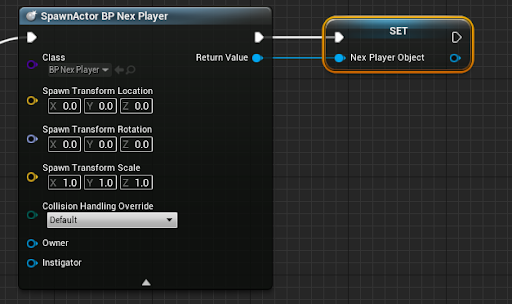
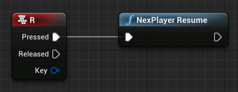

# Blueprint Integration

The NexPlayer™ Plugin for Unreal Engine API allows to integrate the video player functionalities through Blueprints Visual Scripting. 

In the following sections you will learn how to manage all different functionalities of the video player through Visual Scripting.

## Video Player - Minimum Configuration

The NexPlayer™ video player for Unreal Engine must have the following basic functionalities to play a video stream:

### Creating a NexPlayer™ Manager Blueprint

To create the NexPlayer™ video player from Blueprint Visual Scripting, create a Blueprint Class that will manage the creation and destruction of the NexPlayer™ Blueprint Actor:

- Right click on a Content Browser directory and select Blueprints → Blueprint Class:

- Select Actor as the Parent Class:

- Open the Blueprint Actor:

### Spawn the NexPlayer™ Blueprint Actor

The following configuration in the Blueprint Visual Script is required to manually spawn the NexPlayer™ Blueprint and create the NexPlayer™ instance:

-  Create a “? Is Valid“ node. This node will control that we only create a video player at once:

- In the section “Variables” create a new variable named “NexPlayerObject”:

- Change the type of the variable to “BP Nex Player” Reference:

- Include the variable in the Event Graph and connect it to the “Input Object” pin of the “? Is Valid” node:

- Connect the “? Is Valid“ node’s “Is Not Valid” pin to a “SpawnActor” node:

- Set BP_NexPlayer as the input “Class” of the “SpawnActor” node:

- Finally right click on the “Spawn Transform” pin of the “SpawnActor” node and select Split Struct Pin:

### Set Stream URL

It is required to set the following configuration in the Blueprint Visual Script to set the stream content:

- Drag and drop the “NexPlayer Object” to the Event Graph and select “Set NexPlayer Object”:

- Connect the “Return Value” pin of the SpawnActor BP Nex Player to the new “Set” node:

- Create a variable called URL in the Variables section.

- Change the type of URL to String.

- Drag the “Return Value” pin of the “Spawn Actor Nex Player” to the background and search for the “Set Stream URL” variable of NexPlayer.

- Drag and Drop the URL variable and select “Get URL”.

- Connect the “Set NexPlayer Object” to the “Set Stream URL” node and connect the URL variable to the Stream URL pin of the “Set Stream URL” node: 

### Set Target Actors

The following configuration in the Blueprint Visual Script is required to set an array of Target Actors to set the elements to render the video:

- Create a variable named “RenderTargets”.

- Set the type of variable to Static Mesh Actor and Object Reference.

- Set the “Render Targets” variable type to Array.

- Drag and drop the Render Targets variable and select “Get RenderTargets”.

- Drag the “Return Value” pin of the “Spawn Actor Nex Player” to the background and search for the Set Target Actors variable of NexPlayer.

- Connect the Render Targets variable and the “Set Stream URL” node to the “Set Target Actors” node.

### Trigger theCreation Process

The NexPlayer™ video player is correctly set and ready to use. It can be triggered from any Event or Function node: 

- Connect the “? Is Valid” node’s “Exec” input pin to the “Event BeginPlay” node or any other node:

### Destroy NexPlayer™ Blueprint Actor

The following configuration in the Blueprint Visual Script is required to destroy the NexPlayer™ video player instance:

- Create a “? Is Valid” node in the Event Graph:

- Drag and drop the variable ”NexPlayerObject“ to the Event Graph and select “Get NePlayerObject”:

- connect the Nex Player Object variable to the “? Is Valid” node:

- Drag and Drop the “Is Valid” output pin of the “? Is Valid” node and search the “DestroyActor” node:

- Connect the “Nex Player Object” variable and the “? Is Valid” node to the “DestroyActor” node:

- Connect the “? Is Valid” node’s “Exec” input pin to any Event or Function node:

## Video Playback

### Play/Resume

The NexPlayer™ Plugin for Unreal Engine provides a system to Resume the video content if player status is Paused and manage this functionality from Visual Scripting.

- Right click on the Event Graph and search “NexPlayer Resume” and create the node:

- Connect the “NexPlayer Resume” node to any Event or function node:

### Pause

The NexPlayer™ Plugin for Unreal Engine provides a system to Pause the video content if player status is Play and manage this functionality from Visual Scripting.

- Right click on the Event Graph and search “NexPlayer Pause” and create the node:

- Connect the “NexPlayer Pause” node to any Event or Function node:

### Stop

The NexPlayer™ Plugin for Unreal Engine provides a system to Stop the video content if player status is Play and manage this functionality from Visual Scripting. The playback current time will be set to 0 automatically.

- Right click on the Event Graph and search “NexPlayer Stop” and create the node:

- Connect the “NexPlayer Stop” node to any Event or Function node:

## Playback Properties

The NexPlayer™ Plugin for Unreal Engine provides support to configure different playback properties:

**Autoplay:** The video playback will start automatically after loading the video when it’s enabled.

**Looping:** Loop the video content playback when reaching the end of the video content when it’s enabled.

**Mute:** The audio of the video content is disabled when it’s enabled.

- Use the following node to set the properties: 

- You can also change the properties individually:

### Event Delegates

The NexPlayer™ Plugin for Unreal Engine provides support to listen to the different playback events. For that, use the following node to retrieve the Delegate Manager, and use it to bind Custom Events to the desired event.

The supported playback delegates are the following:

### On Loading

This event is triggered whenever the player is loading.

### On Play

This event is triggered whenever the player resumes the playback.

### On Pause

This event is triggered whenever the player pauses the playback.

### On Stop

This event is triggered whenever the playback has stopped.

### On End Content

This event is triggered whenever the player reaches the end of the video content.

### On Buffering

This event is triggered whenever the player is buffering. The delegate retrieves a float with the completion percentage.

### On Status Changed

This event is triggered whenever the player changes its playback status. The delegate retrieves a NexPlayerStatus enum with the new status.

### On Track Changed

This event is triggered whenever the track of the playback has changed. The delegate retrieves an IntPoint with the resolution of the new track.

### On Timed Metadata

This event is triggered whenever new timed metadata is ready for display. Timed metadata includes additional information about the playing content that may be displayed to the user, and this information may change at different times throughout the content. The delegate retrieves a struct that can be split into the different supported ID3 Timed Metadata Tags.

