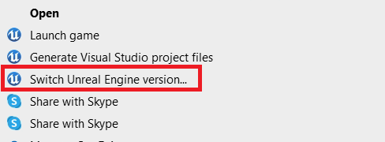
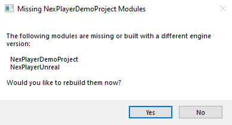

# Example project
## SDK Installation

The NexPlayer™ Plugin for Unreal Engine example project can be downloaded from the following link: [NexPlayerSDK Unreal Example Project v0.8.0](https://customer.nexplayersdk.com/download.php?id=1323&token=f096DpDJUUCYWGXSTkpql6P9alEgF5GS)

It can be used with Unreal Engine version 4.22.3 and above, following these steps:

- If the NexPlayer™ Plugin for Unreal Engine wasn’t downloaded from the UE Marketplace, follow the steps at Set-up guide.
- To open the example project in an Unreal Engine version different than 4.22.3:
	- Right click the NexPlayerDemoProject.uproject file located at the following path: NexPlayerUnreal\NexPlayerDemoProject.project and select “Switch Unreal Engine version...”

- Double click the NexPlayerDemoProject.uproject.
- Select “Yes” at the Missing Project Modules warning.

- Once Unreal Engine is opened, click the button “Play” in the ToolBar.