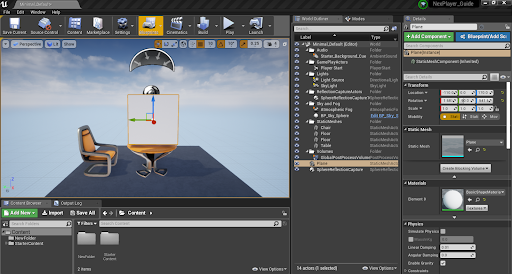
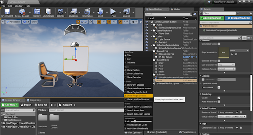
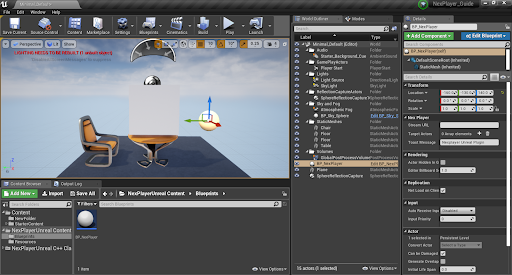
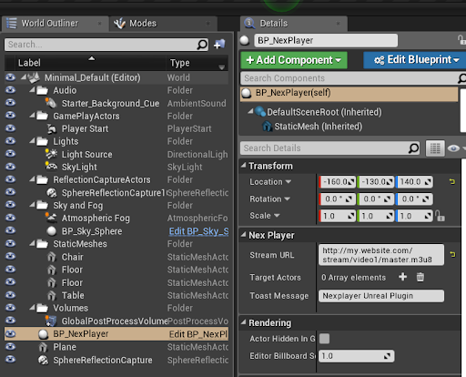
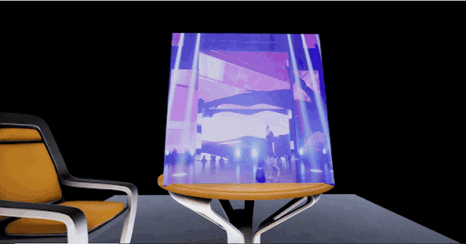

# Quickstart Guide
## Render a Video in a Static Mesh Actor

The NexPlayer™ Plugin for Unreal Engine provides a way to insert a streaming video in any Static Mesh Actor. After importing the NexPlayer™ Plugin into the Unreal Engine project, you should perform the following steps:

It can be used with Unreal Engine version 4.22.3 and above, following these steps:

- Add to the scene some basic Static Mesh Actor where the rendering will occur. It needs to have the UVs properly set. It’s highly recommended to use a Basic Shape Plane or Cube:

- Scale the Actor to match the desired video screen ratio (generally 16:9). On the bottom right corner of the Content Browser, press View Options and make sure that Show Plugin Content is checked:

- Add the **BP_NexPlayer** located at **NexPlayerUnreal Content/Blueprints** to the scene:

- Select the BP_NexPlayer Actor in the scene and set the “Stream URL” variable (in the Details window) to the desired video content URL:

- Add the Cube Shape or Plane you added before to the Target Actors Array in the Details window:

- Play the scene, and you will see your video rendering on the target Static Mesh Actor:

