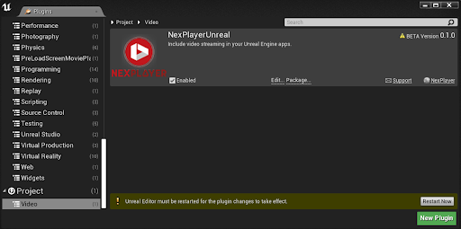

# Set Up Guide

## SDK Installation

The NexPlayer™ Plugin for Unreal Engine is provided as a zip file and can be integrated in any Unreal Engine Project using any Unreal Engine Version. Make sure to extract it.

### Change the plugin Unreal Engine Version

Open the file NexPlayerUnreal\NexPlayerUnreal.uplugin with any code editor. Then, change the value for the “EngineVersion” tag to the desired Unreal Engine Version.

If you have any problems packaging the Plugin in the **Plugins** window, please add the desired platforms as **WhitelistPlatforms** to the NexPlayerUnreal.uplugin.

If you are using Unreal Engine 4.24, you will need to go to **Modules** and remove the **HTML5** option from **WhitelistPlatforms**.

### Install the Plugin on a Project

Copy the NexPlayerUnreal folder to the Plugins folder of your project. If you don’t have a Plugins folder, create one at the root of the project.

### Enable the NexPlayer™ SDK plugin

- Open the Unreal Engine project and click on Edit → Plugins…

- Search for NexPlayerUnreal. It will appear under Built-In/Video or Project/Video, depending if NexPlayer™ was downloaded from the UE Marketplace or not:

- Go to the Project section and select the Video category. Then, in the NexPlayerUnreal Plugin, mark the “Enabled” case.

- A yellow prompt will pop-up to restart the editor. Press the Restart Now button:

- After restarting the Unreal Engine Editor, the plugin will be included in the project. The plugin resources can be accessible pressing Content Browser → View Options and checking “Show Engine Content” or “Show Plugin Content”, depending if NexPlayer™ was downloaded from the UE Marketplace or not:

