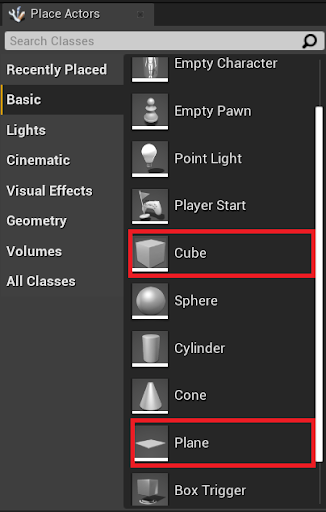

# Unreal Editor

The NexPlayer™ Plugin for Unreal Engine gives developers the option to integrate all the functionalities of the player from the Unreal Editor.

## NexPlayer™ Editor Overview

The BP_NexPlayer blueprint has a NexPlayer™ category that can be accessed from the Details window selecting the actor:

The NexPlayer™ category has the following input variables:

## Stream URL

This variable contains all the relevant information to set the stream URL. This input admits Dash, HLS or RTMP URL paths. 

## Target Actors

This variable contains all the relevant information about the 3D objects where the video will be rendered.

NexPlayer™ recommends having a Static Mesh set with UVs occupying the complete space on each face.

For ease of use, the following Unreal Engine StaticMeshActors can be used, since they match the recommendations:
- Basic/Cube (uses Engine/BasicShapes/Cube).
- Basic/Plane (uses Engine/BasicShapes/Plane).

