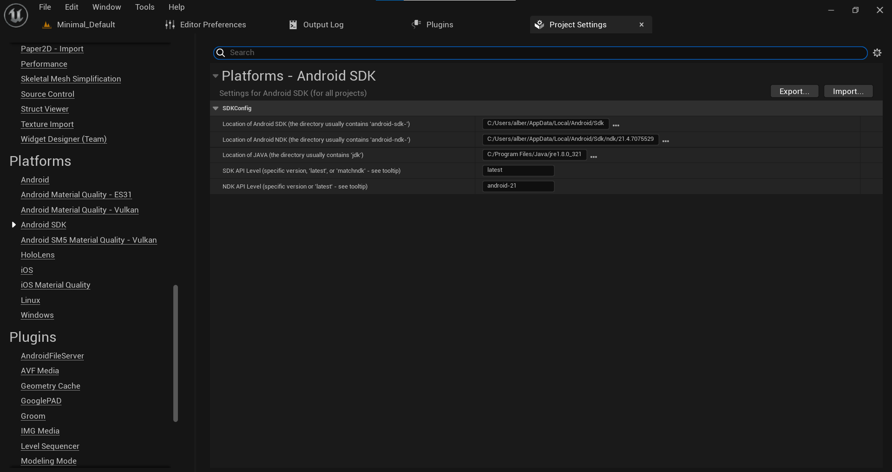
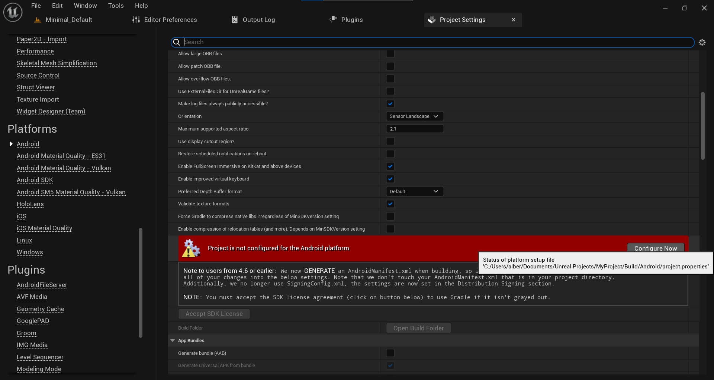
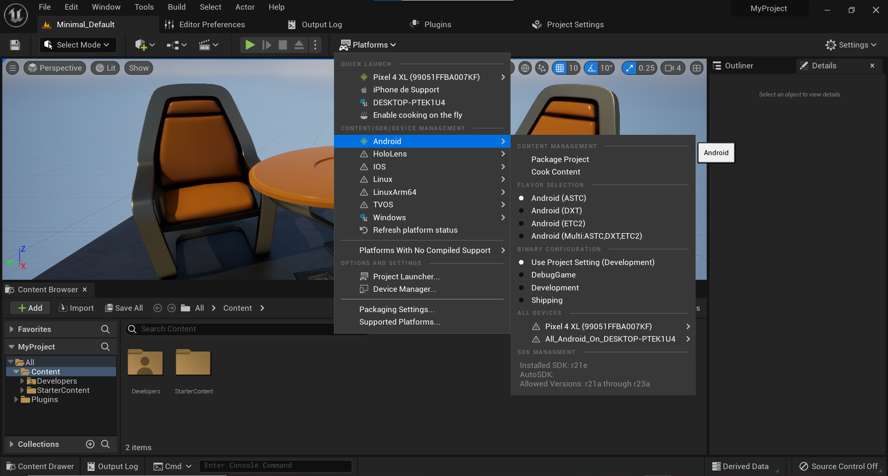
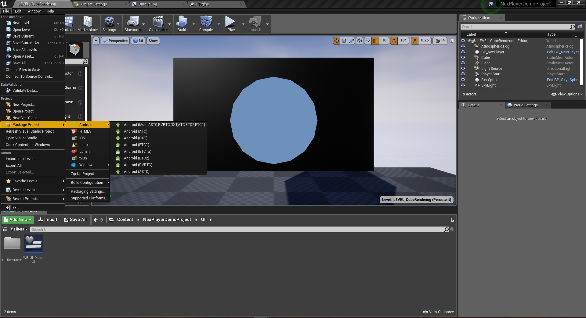

# Android

> **Minimum API level**: 19 (Android 4.4 KitKat).  
**Minimum API level for VR features**: 21 (Android 5 Lollipop).  
**Supported Graphics APIs**: OpenGL ES  3.0 and OpenGL ES 2.0.  
> **Supported Unreal versions** 4.22, 4.23, 4.24, 4.25, 4.26, 4.27 , 5.0, 5.1.

---
## Detailed Feature list
#### Media Source
- Streams (*External URL*)
	- HLS (.m3u8)
	- DASH (.mpd)

#### Rendering Mode 
- Material Override (*material's MainTexture*)

#### Sound Playback Control
- Mute volume

#### Video Playback Control
- Start Player
- Pause Media
- Resume Media
- Stop Media
- Close Player
- Seek
- AutoPlay
- Loop

#### Advanced Features
- Custom tags metadata

#### Miscellaneous
- 360 Media Playback
- Stereoscopic 360 Media Playback
- Play Video on multiple objects

---
## Build Configuration

The NexPlayer™ Plugin for Unreal supports builds for Android applications.

-  set your ndk: project setting → platforms → Andrid SDK

- Configure Android platform : Project settings → platforms → Android

- click apply now.

Unreal 5: Platforms → platforms → Android → Package Project

Unreal 4: Platforms → File → Package Project → android

