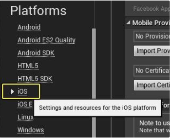

# iOS

> **Minimum API level**: iOS 11.0.  
**Minimum API level for VR features**: iOS 11.0.  
**Supported Graphics APIs**: Metal v2.0 , Metal v2.1 and Metal Destop Renderer.
**Supported Unreal versions** 4.22, 4.27 and 5.X.

---
## Detailed Feature list
#### Media Source
- Streams (*External URL*)
	- HLS (.m3u8)

#### Rendering Mode  
- Material Override (*material's MainTexture*)

#### Sound Playback Control
- Mute volume

#### Video Playback Control
- Start Player
- Pause Media
- Resume Media
- Stop Media
- Close Player
- Seek
- AutoPlay
- Loop

#### Advanced Features
- Custom tags metadata

#### Miscellaneous
- 360 Media Playback
- Stereoscopic 360 Media Playback
- Play Video on multiple objects

---
## Build Configuration

If this is your first time setting up an unreal for ios project in Windows editor please keep in mind the following:
To create a new IPA file that includes the NexPlayer™ Plugin for Unreal, the default configurations must be changed.  

### Setting up an Unreal for IOS on Windows Editor

#### Windows

- **Unreal Engine 4.27 or higher** (Lower versions like 4.22 or 4.23 have a licensing bug building for IOS [IOS 14.5 breaks all Unreal apps made on Windows](https://forums.unrealengine.com/t/ios-14-5-breaks-all-unreal-apps-made-on-windows-and-temporary-workaround/228561/16))
- Iphone with **IOS 14 or lower** (Unreal 4 is not compatible with higher IOS versions [iOS Device Compatibility](https://docs.unrealengine.com/4.26/en-US/SharingAndReleasing/Mobile/iOS/DeviceCompatibility/#:~:text=Unreal%20Engine%204%20(UE4)%20currently,14%2C%2013%2C%20and%2012.))
- **Mac OS** with **Xcode** (If your Xcode version is 13, it might throw an error when packaging. If that is the case, downgrade your Xcode version to 12.5 [IOS packaging error The Legacy Build System](https://forums.unrealengine.com/t/ios-packaging-error-the-legacy-build-system-will-be-removed-in-a-future-release-you-can-configure-the-selected-build-system-and-this-deprecation-message-in-file-workspace-settings/489094/7)) 
- **ITunes app.** (It is important that you download the ITunes app from the official website, and not from the Windows Store. Otherwise, Unreal won’t detect it [iTunes for Windows](https://support.apple.com/es-es/HT210384)) 

#### IOS

Then, you will need to create the iOS provisioning for Windows. You can follow this official Unreal guide: [Set up your iOS development signing certificate](https://docs.unrealengine.com/4.27/en-US/SharingAndReleasing/Mobile/iOS/Provisioning/). (The process will be transcribed now, in case the link is down):

- You need to start the Unreal for IOS project you are going to use. For that, just open your existing project or create a new one, and let it load. Once the loading is done, you can close it.
- Generate a signing certificate. First, navigate to your Engine\Binaries\DotNET\IOS\ directory and run **iPhonePackager.exe.** Since provisioning is project-specific when the **iPhonePackager.exe** is opened, it will first ask you to locate your project's .uproject file. Once you have located your project's .uproject file, click the **Open** button to open it up.


- Select the **New User** tab and click the **Create certificate request and a key pair**... button.


- When you click the button, the **Generate Certificate Request** dialog opens. Inside this box, enter the required information: your **Apple ID, email address, and name (or company name).**


- Click **Generate a key pair** and choose a location to save the **.key** file.


- Click **Generate Certificate Request** and choose a location to save the .csr file. When that is completed, the **Generate Certificate Request** dialog closes, returning you to the main **iPhonePackager** window.


- Go to the [iOS Certificates](https://idmsa.apple.com/IDMSWebAuth/signin?appIdKey=891bd3417a7776362562d2197f89480a8547b108fd934911bcbea0110d07f757&path=%2Faccount%2Fresources%2F&rv=1) page on the Apple iOS Developer site and log in. Click the **Add (+)** button to generate a new certificate.
- Select **iOS App Development** and click **Continue.**


- Click **Choose File** and select the certificate signing request (.csr) file you generated previously and click **Generate.**


- Go to the [iOS Devices](https://idmsa.apple.com/IDMSWebAuth/signin?appIdKey=891bd3417a7776362562d2197f89480a8547b108fd934911bcbea0110d07f757&path=%2Faccount%2Fresources%2F&rv=1) page on the Apple iOS Developer site.
- Click the **Add (+)** button to add a new device.
- Select **Register Device**, enter a name and the UDID for the device and click **Continue.**
- Review the information you have entered, and click **Register.**
- Go to the [iOS App IDs](https://www.google.com/url?q=https://developer.apple.com/account/ios/identifier/bundle&sa=D&source=docs&ust=1663061192448828&usg=AOvVaw26nVl1EJctj95v42BWVYi2) page on the Apple iOS Developer site.
Click the **Add (+)** button to add a new **App ID.**


- Enter a name for the **App ID.**
- Select the **App ID Prefix** for your **App ID.**


- Select **Wildcard** for the type of **App ID** to create and set the **Bundle ID.**


- Click **Continue** and **Register.**
- Go to the [iOS Provisioning Profiles](https://www.google.com/url?q=https://developer.apple.com/account/ios/profile/profileList.action&sa=D&source=docs&ust=1663061341918750&usg=AOvVaw2Mn3PhD5qGp763EFaM93FM) page on the Apple iOS Developer site.
- Click the **Add (+)** button to add a new profile.
Under **Development**, select **iOS App Development** and click **Continue**.


- Choose the App ID you created previously and click **Continue**.


- Select the certificate you created previously and click **Continue**.


- Select all of the devices you want associated with the profile. Only devices selected here will be able to have your game launch on them.


- Enter a name for the profile and click Generate.

- Download the profile (.mobileprovision file) to your computer.


#### Building for IOS

Once the IOS provisioning has been done, it is time for preparing everything necessary for making the packaging for IOS from a Windows PC. You can follow this official Unreal guide : [Building for iOS on Windows | Unreal Engine Documentation](https://docs.unrealengine.com/4.27/en-US/SharingAndReleasing/Mobile/iOS/Windows/). (The process will be transcribed now, in case the link is down):

Apple has changed the default shell scripting language from to zsh, which sometimes creates errors launching Unreal Engine builds on iOS. If this happens, the output logs will contain the zsh and rsync errors similar to the following:

```csharp
LogPlayLevel:     zsh:1: no matches found: /Users/[UserName]/UE4/Builds/[DesktopName]/C/Program_Files/Epic_Games/UE_4.26/Engine/Intermediate/IOS/*.plist
LogPlayLevel:     zsh:1: no matches found: /Users/[UserName]/UE4/Builds/[DesktopName]/C/Program_Files/Epic_Games/UE_4.26/Engine/Intermediate/TVOS/*.plist
LogPlayLevel:     zsh:1: no matches found: /Users/[UserName]/UE4/Builds/[DesktopName]/C/Users/[UserName]/Documents/Unreal_Projects/[ProjectName]/Intermediate/IOS/*.plist
LogPlayLevel:     zsh:1: no matches found: /Users/[UserName]/UE4/Builds/[DesktopName]/C/Users/[UserName]/Documents/Unreal_Projects/[ProjectName]/Intermediate/TVOS/*.plist
LogPlayLevel:   [Remote] Executing build
LogPlayLevel:     zsh:1: no matches found: -ini:Game:[/Script/UnrealEd.ProjectPackagingSettings]:BlueprintNativizationMethod=Disabled
LogPlayLevel:   [Remote] Downloading C:\Users[UserName]\AppData\Roaming\Unreal Engine\AutomationTool\Logs\C+Program+Files+Epic+Games+UE_4.26[ProjectName]-IOS-Development_Remote.txt
LogPlayLevel:     rsync: link_stat "/Users/[UserName]/UE4/Builds/[DesktopName]/C/Users/[UserName]/AppData/Roaming/Unreal_Engine/AutomationTool/Logs/C+Program+Files+Epic+Games+UE_4.26/[ProjectName]-IOS-Development_Remote.txt" failed: No such file or directory (2)
LogPlayLevel: Error:     rsync error: some files/attrs were not transferred (see previous errors) (code 23) at /home/lapo/packaging/rsync-3.0.4-1/src/rsync-3.0.4/main.c(1506) [receiver=3.0.4]
LogPlayLevel: Error:   ERROR: Unable to download 'C:\Users[UserName]\AppData\Roaming\Unreal Engine\AutomationTool\Logs\C+Program+Files+Epic+Games+UE_4.26[ProjectName]-IOS-Development_Remote.txt' from the remote Mac (exit code 23).
LogPlayLevel: Took 21.2652808s to run UnrealBuildTool.exe, ExitCode=5
LogPlayLevel: UnrealBuildTool failed. See log for more details. (C:\Users[UserName]\AppData\Roaming\Unreal Engine\AutomationTool\Logs\C+Program+Files+Epic+Games+UE_4.26[ProjectName]-IOS-Development.txt)
LogPlayLevel: AutomationTool exiting with ExitCode=5 (5)
LogPlayLevel: Completed Launch On Stage: Build Task, Time: 20.779392
LogPlayLevel: BUILD FAILED
PackagingResults: Error: Launch failed! Unknown Error
```
If you experience this issue, follow these steps to set bash as your default scripting language instead:

- Open the **Apple Menu**, then click **System Preferences**.
- Open **Users & Groups**.


- Click the **lock** icon, then enter your account name and password.


- Control-click your user name in the list of users, then choose **Advanced Options**.
- Click the **Login shell** dropdown menu, then set your shell to bin/bash instead of bin/zsh.


Once you have set up your project, you will need to configure your Mac to allow SSH connections.

- Open your Mac's **System Preferences**, then navigate to **Sharing**.


- Check the box for **Remote Login**.


- Open System **Preferences > Network**.
Note the computer's IP Address. You will need this for setting up the remote connection on your Windows PC.


Once you have completed these steps, your Mac will be able to accept an incoming SSH connection from your PC.
Now, open your Unreal project and complete the following steps on your Windows machine to configure it for remote iOS builds.

- Open your project in **Unreal Editor**, then open **Project Settings**.

- Navigate to **Platforms > iOS > Build**.



- In the **Remote Server Name** field, enter either the name of the Mac you are using to build the project, or its IP address.

- In the **Remote User Name** field, enter the username that you would normally use to log in to the Mac.

- Click **Generate SSH Key**. This will open a Command Prompt window with a series of prompts that will generate the SSH key.


If you receive a message that your host could not be authenticated, enter "yes" in the prompt to continue.

- Enter the **password** that belongs to the user you specified in **Remote User Name** in the previous section.

- The prompt will ask you for a **passphrase**. If you choose not to enter a passphrase, you can use the remote connection without requiring any user interaction.

- When prompted, enter the **password and username** for the Mac again to complete the process.

Now that you have generated an SSH key, you will be able to start a remote connection on your Windows machine to your Mac for creating iOS builds.
To share this data for other projects in the future, specify the Remote Server Name and Remote User Name in one of the *Engine.ini files on your computer.

- Select the button next to the Remote Server Name property to open the Configuration Editor.


- Set the properties for each individual .ini file for which you want to share the SSH data.


Repeat these steps for **Remote User Name**.
By sharing these .ini files, you can keep the SSH information available for multiple projects or users. The SSH keys themselves are stored in the Engine/Build/SSHKeys folder. You can check this directory into your source control system to share them with your team.

- Import the mobile provision and certificate you previously created.


- Add a bundle identifier which matches with the provision you previously created.


- After completing the above steps, you can initiate a remote build by clicking **File > Package Project > iOS** in the Unreal Editor on your Windows machine. A SSH connection and send the command to your Mac to begin making a build

#### Workaround For Unprotected Private Key

When packaging, you might see an error that reads as follows:

```csharp
me directory for remote user. SSH output:...WARNING: UNPROTECTED PRIVATE KEY FILE!...0660
PackagingResults: Error: Launch failed! Unknown Error
```
To solve it, do the following:

- Navigate to your RemoteToolChainPrivate.key.
- Right-click the file and select **Properties**.
- Click the **Security** tab.
- Click **Edit**.
- Remove all group or user names.
- Click **Add**.
- Click **Object Types**. Make sure all boxes are checked, then click **OK**.
- In the text box, type **Users**, then press Enter.
- Make sure that permissions for Users are set to **Read** and **Read & Execute**.

This will change the file's primary group so that it is not the same as your username, which is what confuses SSH when it checks group permissions. The process should then work as normal.

#### Execute the IPA file in your device

For executing the .ipa file in your Iphone, open ITunes and drag the .ipa to your connected device, which should be appearing on the left side of the app.


### Build with previous setting

- Go to Edit → Project Settings → IOS. And set the Rendering settings  as the following example: 


NexPlayer is compatible with Metal v2.0 and Metal v2.1.
Metal Desktop Renderer function can also be added.

- To package the project, go to File → Package Project → IOS and select the folder destination.