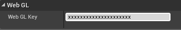
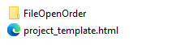
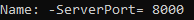

# WebGL

> **Minimum browsers version**, Google Chrome 75, Mozilla Firefox 67, Opera 12, Microsoft Edge 18 and Apple Safari 12.1.
> **Supported Unreal versions** 4.22 and 4.23.

---
## Detailed feature list

#### Media Source
- Streams (*External URL*)
	- HLS (.m3u8)
	- DASH (.mpd)

#### Rendering Mode  
- RawImage (*Unreal UI*)	

#### Sound Playback Control
- Mute volume

#### Video Playback Control
- Start Player
- Pause Media
- Resume Media
- Stop Media
- Seek
- AutoPlay
- Loop

#### Miscellaneous
- 360 Media Playback

#### Browser Support
- Chrome
- Firefox
- Opera
- Edge

---
## Build Configuration
### Build with NexPlayer Templates

The NexPlayer™ Plugin for Unreal supports Builds for WebGL applications.

To build the application the first time on a new project with Nexplayer’s Template do the following:

- In the Unreal editor, select the scene object with the NexPlayer Blueprint and insert the corresponding WebGL key. 



- Go to File → Refresh Visual Studio Project and then  File → Package Project → HTML5. Select a destination folder outside the Unreal project directory. Let it complete the packaging of the project.

- Go to the Plugins\NexPlayerUnreal\Build\HTML5 directory and copy the project_template.html and paste it in the newly created Build\HTML5 on the project’s root folder.



- Package the project one more time like in step 2.

This process is only necessary the first time the project is builded. For all the next builds, just do the regular packaging like in step 2.


To open the WebGL on a local server, execute the HTML5LaunchHelper.exe on your build folder. To visualize it, open the web browser and introduce localhost:XXXX, with the port number that is indicated in the HTML5LaunchHelper console.



### Build with Custom Template

If you want to create your own custom template, keep in mind that you need to include **nexplayer.js and nexplayerUnreal.js** inside your index.html file as follows:
```csharp
<head>
      . . .
<script src="https://nexplayer.nexplayersdk.com/8.0.0/nexplayer.js" >
</script>
    <script src="https://d1s68t328djb4k.cloudfront.net/WebGLUnreal/v1.0/NexPlayerUnreal.js"
 ></script>
</head>
```

These 2 lines include the WebGL plugins which are necessary for the player to work in browsers.
Then, follow the process detailed in section 4.3.2. Build with NexPlayer’s Template  to use NexPlayer in a custom template and build the application.

### Browser Autoplay Policy

Due to browser autoplay policies, in order to make the HTML5 build you will have to select the mute option if the Autoplay function is activated. This is because sound can’t be  until the user interacts with the page.
