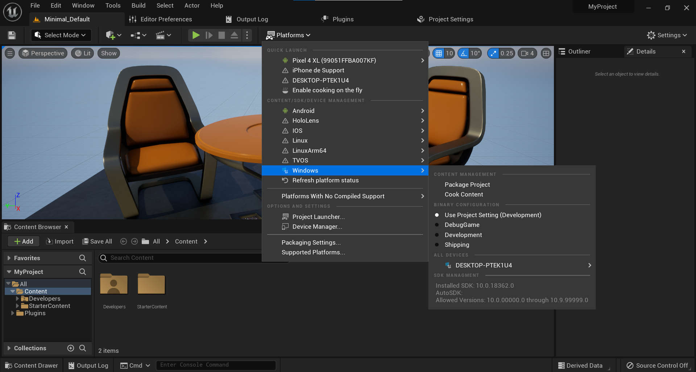
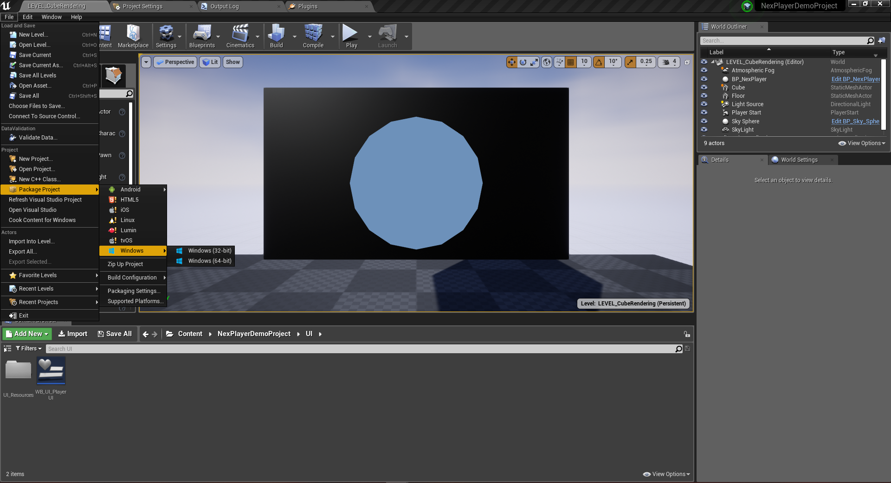

# Windows

> Minimum OS: Windows 10 using update Version 2004 and definition update KB4052623 26/08.  
Minimum CPU: Intel Core i7-4710MQ x64.  
Minimum Memory: 8GB RAM.  
Minimum GPU: NVIDIA GeForce 840M 2GB.  
Supported Graphics APIs: DirectX 11.

---
## Detailed feature list

#### Media Source
- Streams (*External URL*)
	- HLS (.m3u8)
	- DASH (.mpd)
	- RTMP
	- MP4 (.mp4)
- AssetPlay (*Streaming Assets folder*)
	- MP4 (.mp4)
	- AVI (.avi)
	- MKV (.mkv)
- Local Play (*Any local folder*)
	- MP4 (.mp4)
	- AVI (.avi)
	- MKV (.mkv)

#### Rendering Mode  
- RawImage (*Unreal UI*)	
- RenderTexture (*Unreal Asset*)
- Material Override (*material's MainTexture*)

#### Sound Playback Control
- Volume Control
- Mute volume

#### Video Playback Control
- Start Player
- Pause Media
- Resume Media
- Stop Media
- Close Player
- Seek
- AutoPlay
- Loop
- Maximize Screen
- Change Aspect Ratio
- Run In Background

#### Miscellaneous
- Adaptive Bitrate (*ABR*)
- Progressive Download
- 360 Media Playback
- Stereoscopic 360 Media Playback
- Video with transparency (*Chroma Shader*)
- Video Spread (*World Space Shader*)
- Play Video on multiple objects

#### Subtitles
- Display WebVTT Subtitles

#### Audio Codecs
- AAC-LC
- HE-AAC

#### Video Codecs
- H.264
- MPEG-4

---
## Build Configuration
The NexPlayer™ Plugin for Unreal supports Standalone Builds for Windows.

Unreal 5: Platforms → Windows → Package Project

Unreal 4: File → Windows

